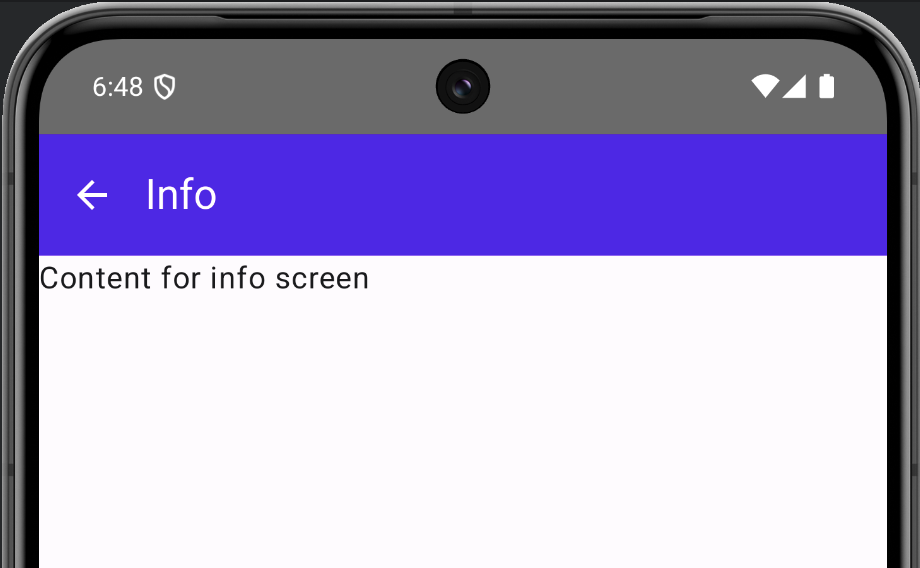

# Scaffold and navigation
This walkthrough can be implemented on top of Scaffold walkthrough implemented earlier. 
Navigation is added so user is able to navigate between multiple screens.

You should be able to navigate between main, info and settings screens.

## Implemented UI

